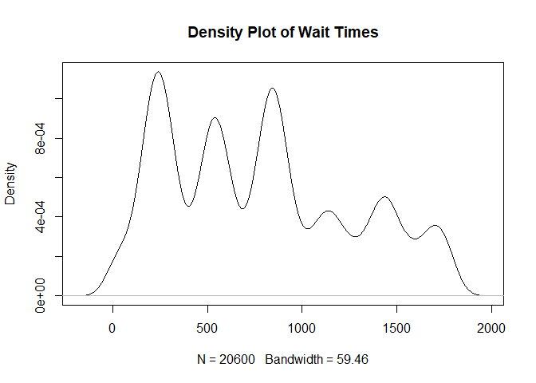
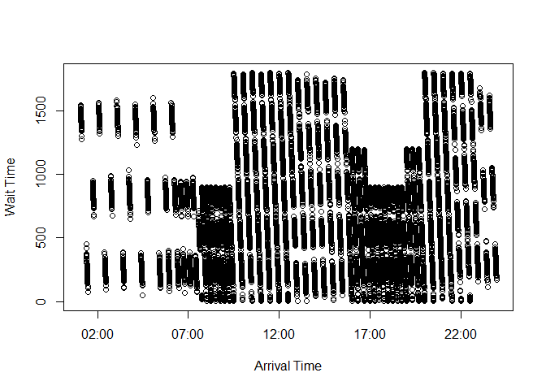
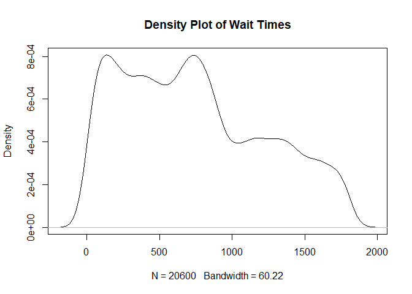
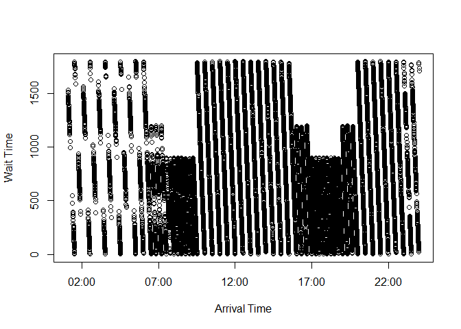
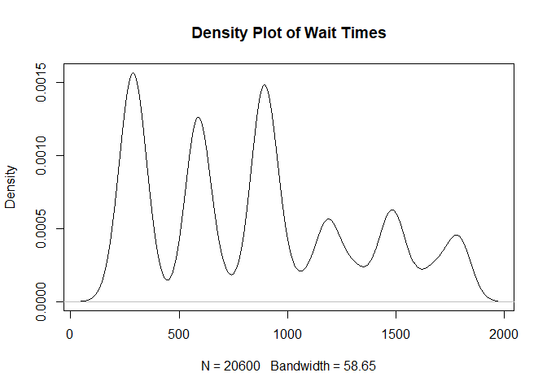
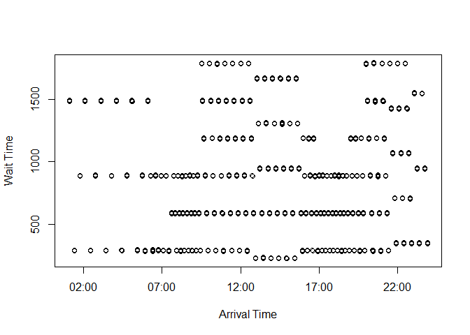

Simulated Lateness Distributions
================
Clare Clingain

# Introduction

From the MTA data, I’ll obtain lateness distributions which will show by
how many minutes people miss the connection between the 1 train and the
Staten Island ferry. Before looking at the empirical distributions, I’ll
first simulate what these distributions could look like given a set of
assumptions.

We first assume that the 1 train and the Staten Island ferry have fixed
schedules. We can then work with two possible assumptions:

1)  normal distribution of lateness with some variance (fixed through
    the day)

2)  beta distribution of lateness. Since the beta distribution is
    positive, this means that trains will always be late (gets worse
    throughout the day)

# Data Structure

The simulated data will start off with two columns: time stamps for
schedule and day number (1:n). The noise will be added as a third
column, with the fourth column calculated as the final arrival times.

# Simulation Set-up

## 1 train schedule

Based off of the real
[schedule](http://web.mta.info/nyct/service/pdf/t1cur.pdf), I will
create an approximate one since the PDF doesn’t contain complete time
stamps. Note that I’m assuming a weekday schedule.

``` r
start_time <- as.POSIXct("2018-01-01 01:04:00")
# train is every 20 minutes until 5:40ish
diff <- 60*20
times <- NULL
for(i in 1:15){
  if(i == 1){
    times[i] <- start_time
  } else {
    prev <- i - 1
  times[i] <- times[prev] + diff
  }
}
# train is every 10 minutes until 7:25ish
diff <- 60*10
for(i in 16:27){
  prev <- i - 1
  times[i] <- times[prev] + diff
}
# train is every 4-6 minutes until 12:25ish (will go with 5 mins)
diff <- 60*5
for(i in 28:88){
  prev <- i - 1
  times[i] <- times[prev] + diff
}
# train is every 6 minutes until 3:51ish
diff <- 60*6
for(i in 89:119){
  prev <- i - 1
  times[i] <- times[prev] + diff
}
# train is every 4-6 minutes until 9:37ish (pm) (will go with 5 mins)
diff <- 60*5
for(i in 119:187){
  prev <- i - 1
  times[i] <- times[prev] + diff
}
# train is every 6 minutes until 11ish
diff <- 60*6
for(i in 187:200){
  prev <- i - 1
  times[i] <- times[prev] + diff
}
# train is every 10 minutes till 12:50ish
diff <- 60*10
for(i in 201:206){
  prev <- i - 1
  times[i] <- times[prev] + diff
}
# convert back to POSIX
class(times) <- c('POSIXt', 'POSIXct')
```

This will serve as our fixed 1 train schedule.

## Ferry schedule

The Staten Island bound ferry schedule can be found
[here](https://www.siferry.com/schedules.html). Note that I’m assuming a
weekday schedule.

``` r
ferry_start <- as.POSIXct("2018-01-01 00:00:00")
# every half hour until 6:30 (then goes to 6:50)
diff <- 60*30
ferry_times <- NULL
for(i in 1:14){
  if(i == 1){
    ferry_times[i] <- ferry_start
  } else {
    prev <- i - 1
  ferry_times[i] <- ferry_times[prev] + diff
  }
}
# next 3 are every 20 minutes
diff <- 60*20
for(i in 15:17){
  prev <- i - 1
  ferry_times[i] <- ferry_times[prev] + diff
}
# every 15 minutes
diff <- 60*15
for(i in 18:25){
  prev <- i - 1
  ferry_times[i] <- ferry_times[prev] + diff
    
}
# every 30 minutes
diff <- 60*30
for(i in 26:38){
  prev <- i - 1
  ferry_times[i] <- ferry_times[prev] + diff
}
# every 20 minutes
diff <- 60*20
for(i in 39:41){
  prev <- i - 1
  ferry_times[i] <- ferry_times[prev] + diff
}
# every 15 minutes
diff <- 60*15
for(i in 42:49){
  prev <- i - 1
  ferry_times[i] <- ferry_times[prev] + diff
}
# every 20 minutes
diff <- 60*20
for(i in 50:52){
  prev <- i - 1
  ferry_times[i] <- ferry_times[prev] + diff
}
# every 30 minutes
diff <- 60*30
for(i in 53:61){
  prev <- i - 1
  ferry_times[i] <- ferry_times[prev] + diff
}
# Convert back to time
class(ferry_times) <- c('POSIXt', 'POSIXct')
```

## Normal noise

``` r
norm_sims <- function(days,noise_mean, noise_sd, seed){
  # Initiate data frame
  data <- NULL
  # Create timestamps for given # of days
  data$schedule <- rep(times,days)
  # Add in the day id
  data$dayid <- rep(1:days, each = length(times))
  
  # Create the noise term (in seconds)
  set.seed(seed)
  data$noise <- rnorm(length(data$schedule),noise_mean,noise_sd)
  # Round for time 
  data$noise <- round(data$noise,0)
  
  # Create updated arrival time
  data$arrival <- data$schedule + data$noise
  
  # return the data
  return(as.data.frame(data))
}
```

Test with 100
days

``` r
sim1 <- norm_sims(days = 100, noise_mean = 65, noise_sd = 30, seed = 10314)

summary(sim1$noise)
```

    ##    Min. 1st Qu.  Median    Mean 3rd Qu.    Max. 
    ##  -68.00   45.00   65.00   65.19   85.00  190.00

``` r
plot(density(sim1$noise), main = "Lateness")
```

<!-- -->

## Beta function

``` r
beta_sims <- function(days,noise_beta, noise_alpha, seed){
  # Initiate data frame
  data <- NULL
  # Create timestamps for given # of days
  data$schedule <- rep(times,days)
  # Add in the day id
  data$dayid <- rep(1:days, each = length(times))
  
  # Create the noise term (in seconds)
  set.seed(seed)
  data$noise <- rbeta(length(data$schedule),shape2 = noise_beta,shape1 = noise_alpha)
   # Convert to seconds
  data$noise <- data$noise*60 + 60
  # Round for time 
  data$noise <- round(data$noise,0)

  # Create updated arrival time
  data$arrival <- data$schedule + data$noise
  
  # return the data
  return(as.data.frame(data))
}
```

Test with 100
days

``` r
sim1 <- beta_sims(days = 100, noise_beta = 120, noise_alpha = 30, seed = 10314)

summary(sim1$noise)
```

    ##    Min. 1st Qu.  Median    Mean 3rd Qu.    Max. 
    ##   66.00   71.00   72.00   72.01   73.00   81.00

``` r
plot(density(sim1$noise), main = "Lateness")
```

<!-- -->

## Create function to extract wait times and connections

``` r
get_wait <- function(data){
  ## Step 1: Find the closest ferry
  closest_ferry <- unlist(lapply(data$arrival, FUN = function(x) min(which((ferry_times - x)>0))))

  data$closest_ferry <- closest_ferry
  
  ## Step 2: Get ferry time stamp
  ferry_timestamp <- unlist(lapply(data$closest_ferry, FUN = function(x)ferry_times[x]))
  data$ferry_departure <- ferry_timestamp
  class(data$ferry_departure) <- c('POSIXt', 'POSIXct')
  
  ## Step 3: Obtain wait times
  data$wait_time <- as.numeric(data$ferry_departure - data$arrival)
  
  # if it looks like it's in minutes, change to seconds
  if(mean(data$wait_time)<120){
      data$wait_time <- data$wait_time*60
  } else {
    
  }

  ## Step 4: Obtain scheduled wait times
  data$wait_time_predicted <- as.numeric(data$ferry_departure - data$schedule)*60
  
  ## Step 5: Obtain scheduled closest ferries
  data$closest_ferry_predicted <- unlist(lapply(data$schedule, FUN = function(x) min(which((ferry_times - x)>0))))

  ## Step 6: Get the predicted ferry connections
  data$ferry_predicted <- unlist(lapply(data$closest_ferry, FUN = function(x)ferry_times[x]))

class(data$ferry_predicted) <- c('POSIXt', 'POSIXct')

return(data)
}
```

# Simulations

## Normal with average delay of 2 minutes

``` r
sims <- norm_sims(days = 100, noise_mean = 120, noise_sd = 60, seed = 10314)
sims_results <- get_wait(sims)

summary(sims_results$wait_time)
```

    ##    Min. 1st Qu.  Median    Mean 3rd Qu.    Max. 
    ##     1.0   320.0   766.0   776.6  1133.0  1800.0

``` r
# % different from their actual connections?
sum(sims_results$closest_ferry==sims_results$closest_ferry_predicted)/dim(sims_results)[1]
```

    ## [1] 0.8607767

``` r
# graph it
plot(density(sims_results$wait_time))
```

<!-- -->

``` r
plot(y = sims_results$wait_time, x = sims_results$arrival)
```

<!-- -->

## Normal with average delay of 4 minutes

``` r
sims2 <- norm_sims(days = 100, noise_mean = 240, noise_sd = 120, seed = 10314)
sims_results2 <- get_wait(sims2)

# NOTE: current issue coming from some dates being made that are pushed onto the next day. Solution: added 12:30am ferry for next day so that it'll recognize that time stamp as teh closest

summary(sims_results2$wait_time)
```

    ##    Min. 1st Qu.  Median    Mean 3rd Qu.    Max. 
    ##       1     326     684     736    1107    1800

``` r
# % different from their actual connections?
sum(sims_results2$closest_ferry==sims_results2$closest_ferry_predicted)/dim(sims_results2)[1]
```

    ## [1] 0.8038835

``` r
# graph it
plot(density(sims_results2$wait_time))
```

<!-- -->

``` r
plot(y = sims_results2$wait_time, x = sims_results2$arrival)
```

<!-- -->

## Beta with beta delay of 2 minutes

``` r
sims3 <- beta_sims(days = 100, noise_beta = 120, noise_alpha = 30, seed = 10314)
sims_results3 <- get_wait(sims3)

summary(sims_results3$wait_time)
```

    ##    Min. 1st Qu.  Median    Mean 3rd Qu.    Max. 
    ##   222.0   350.0   887.0   859.2  1189.0  1794.0

``` r
# % different from their actual connections?
sum(sims_results3$closest_ferry==sims_results3$closest_ferry_predicted)/dim(sims_results3)[1]
```

    ## [1] 0.8349515

``` r
# graph it
plot(density(sims_results3$wait_time))
```

<!-- -->

``` r
plot(y = sims_results3$wait_time, x = sims_results3$arrival)
```

<!-- -->
