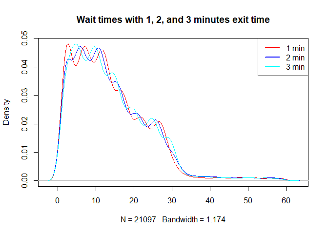

Wait Time Analysis
================
Clare Clingain

# Research Questions

Here are the research questions I hope to answer:

1)  What does the distribution of lateness look like for connections
    between the 1 train and the Staten Island Ferry?

2)  How does this distribution vary across time (e.g., rush hour vs
    tourist peak)?

3)  How does this distribution vary for people who can run versus people
    who can’t run from the 1 train to the ferry?

# Initial Visualizations

## Density plots

``` r
# overlay plot
plot(density(analysis_data$wait_times_1min), main = "Wait times with 1, 2, and 3 minutes exit time", col = 2)
lines(density(analysis_data$wait_times_2min), col = 4)
lines(density(analysis_data$wait_times_3min), col = 5)
legend("topright",legend = c("1 min","2 min","3 min"), lty = 1, lwd = 2, col = c(2,4,5))
```

<!-- -->

The three distributions look quite similar. In terms of the simulations
I ran, these distributions look like the beta distribution
results.

## Time (hour) x Wait times

``` r
plot(as.factor(analysis_data$hour), analysis_data$wait_times_1min, main = "Wait times  (1 min exit time)",xlab = "Hour of day",ylab = "Wait time")
```

<!-- -->

``` r
plot(as.factor(analysis_data$hour), analysis_data$wait_times_2min, main = "Wait times  (2 min exit time)",xlab = "Hour of day",ylab = "Wait time")
```

<!-- -->

``` r
plot(as.factor(analysis_data$hour), analysis_data$wait_times_3min, main = "Wait times (3 min exit time)",xlab = "Hour of day",ylab = "Wait time")
```

<!-- -->

It makes sense that the waits pile up late at night and during the
tourist peak hours (10-3). I’m curious seeing that the very lengthy wait
times caused by a missing ferry are so dispersed. I initially thought
that it would be worse in the wee hours of the morning, but it looks to
be a problem throughout the day. This isn’t concerning in terms of
something being wrong with the data because there are many reasons why a
ferry or a train never shows. Both can break down, both can have sick
passengers, and both can barely miss each other.

``` r
# medians
medians_IQR <- analysis_data %>% 
  group_by(as.factor(hour)) %>% 
  summarise(median_1min = median(wait_times_1min),
            median_2min = median(wait_times_2min),
            median_3min = median(wait_times_3min),
            IQR_1min = IQR(wait_times_1min),
            IQR_2min = IQR(wait_times_2min),
            IQR_3min = IQR(wait_times_3min))
colnames(medians_IQR)[1] <- "hour"
# plot the medians and IQR
plot(x = as.numeric(medians_IQR$hour), y = medians_IQR$median_1min, pch = 16, main = "Median wait times by hour", ylab = "Wait time (in minutes)", xlab = "Hour")
lines(x = as.numeric(medians_IQR$hour), y = medians_IQR$median_1min, lwd = 2)
lines(x = as.numeric(medians_IQR$hour), y = medians_IQR$median_2min, lwd = 2, col = 2, type = 'o', pch = 16)
lines(x = as.numeric(medians_IQR$hour), y = medians_IQR$median_3min, lwd = 2, col = 4, type = 'o', pch = 16)
legend("bottomright",legend = c("1 min","2 min","3 min"), lty = 1, lwd = 2, col = c(1,2,4))
```

<!-- -->

For the rush-hour and tourist peak hours, it looks like time-to-exit
doesn’t make a difference. A longer time-to-exit does seem to matter for
the late night/early morning hours.

## Time (weekday) x Wait times

Now I’ll check the wait times by
weekday.

``` r
plot(analysis_data$weekday, analysis_data$wait_times_1min, main = "Wait times (1 min exit time)",xlab = "Day of the week",ylab = "Wait time")
```

<!-- -->

``` r
plot(analysis_data$weekday, analysis_data$wait_times_2min, main = "Wait times (2 min exit time)",xlab = "Day of the week",ylab = "Wait time")
```

<!-- -->

``` r
plot(analysis_data$weekday, analysis_data$wait_times_3min, main = "Wait times (3 min exit time)",xlab = "Day of the week",ylab = "Wait time")
```

<!-- -->

There doesn’t seem to be much difference across days of the
week.

## Time (Month) x Wait times

``` r
plot(as.factor(analysis_data$month), analysis_data$wait_times_1min, main = "Wait times (1 min exit time)",xlab = "Month",ylab = "Wait time")
```

<!-- -->

``` r
plot(as.factor(analysis_data$month), analysis_data$wait_times_2min, main = "Wait times (2 min exit time)",xlab = "Month",ylab = "Wait time")
```

<!-- -->

``` r
plot(as.factor(analysis_data$month), analysis_data$wait_times_3min, main = "Wait times (3 min exit time)",xlab = "Month",ylab = "Wait time")
```

<!-- -->

## Time (Rush vs nonrush) x Wait times

Next, I’ll have a look at the three distributions by rush
hour.

``` r
plot(as.factor(analysis_data$rushour), analysis_data$wait_times_1min, main = "Wait times (1 min exit time)",xlab = "Rush hour vs Non-rush hour",ylab = "Wait time")
```

<!-- -->

``` r
plot(as.factor(analysis_data$rushour), analysis_data$wait_times_2min, main = "Wait times (2 min exit time)",xlab = "Rush hour vs Non-rush hour",ylab = "Wait time")
```

<!-- -->

``` r
plot(as.factor(analysis_data$rushour), analysis_data$wait_times_3min, main = "Wait times (3 min exit time)",xlab = "Rush hour vs Non-rush hourk",ylab = "Wait time")
```

<!-- -->

As expected, wait times are longer outside of rush hour. However, non
rush hour includes late night hours as well as tourist peak hours. I’ll
break it down further by tourist peak hours.

# Test the difference between the wait distributions

I will use the two-sample Kolmogorov-Smirnov test to determine whether
each distribution is different from the other two. I will adjust my
p-values to reflect the multiple
tests.

``` r
one_two_res <- ks.test(analysis_data$wait_times_1min, analysis_data$wait_times_2min)
```

    ## Warning in ks.test(analysis_data$wait_times_1min,
    ## analysis_data$wait_times_2min): p-value will be approximate in the presence
    ## of ties

``` r
one_two_res
```

    ## 
    ##  Two-sample Kolmogorov-Smirnov test
    ## 
    ## data:  analysis_data$wait_times_1min and analysis_data$wait_times_2min
    ## D = 0.024174, p-value = 8.845e-06
    ## alternative hypothesis: two-sided

``` r
one_three_res <- ks.test(analysis_data$wait_times_1min, analysis_data$wait_times_3min)
```

    ## Warning in ks.test(analysis_data$wait_times_1min,
    ## analysis_data$wait_times_3min): p-value will be approximate in the presence
    ## of ties

``` r
one_three_res
```

    ## 
    ##  Two-sample Kolmogorov-Smirnov test
    ## 
    ## data:  analysis_data$wait_times_1min and analysis_data$wait_times_3min
    ## D = 0.032564, p-value = 3.848e-10
    ## alternative hypothesis: two-sided

``` r
two_three_res <- ks.test(analysis_data$wait_times_2min, analysis_data$wait_times_3min)
```

    ## Warning in ks.test(analysis_data$wait_times_2min,
    ## analysis_data$wait_times_3min): p-value will be approximate in the presence
    ## of ties

``` r
two_three_res
```

    ## 
    ##  Two-sample Kolmogorov-Smirnov test
    ## 
    ## data:  analysis_data$wait_times_2min and analysis_data$wait_times_3min
    ## D = 0.018533, p-value = 0.001425
    ## alternative hypothesis: two-sided

``` r
# adjust p-values
paste("The adjusted p-values for each respective test are",p.adjust(c(one_two_res$p.value, one_three_res$p.value, two_three_res$p.value), method = "hochberg"))
```

    ## [1] "The adjusted p-values for each respective test are 1.76906773210472e-05"
    ## [2] "The adjusted p-values for each respective test are 1.15447484905218e-09"
    ## [3] "The adjusted p-values for each respective test are 0.00142522132395195"

We see a significant difference between all three distributions.
Although this is great news, I strongly wonder if the data violate the
iid assumption of the KS test. Even though some wait times may be
independent of one another (i.e., morning rush from evening rush,
January from June), I doubt that this is the case across all the data.
Two consectutive trains are unlikely to be independent. Nevertheless,
this test gives us an additional piece of information that we will use
with caution.

# Test difference between distribution means

As discussed above, the iid assumption is trick with this data. However,
I’d like to get some 95% confidence intervals for the difference between
the
means.

``` r
t1 <- t.test(analysis_data$wait_times_1min, analysis_data$wait_times_2min)
t2 <- t.test(analysis_data$wait_times_1min, analysis_data$wait_times_3min)
t3 <- t.test(analysis_data$wait_times_2min, analysis_data$wait_times_3min)
paste("The 95% confidence interval for the difference in means between 1min vs 2min is (", round(t1$conf.int[1],3),",", round(t1$conf.int[2],3),")")
```

    ## [1] "The 95% confidence interval for the difference in means between 1min vs 2min is ( -0.508 , -0.133 )"

``` r
paste("The 95% confidence interval for the difference in means between 1min vs 3min is (", round(t2$conf.int[1],3),",", round(t2$conf.int[2],3),")")
```

    ## [1] "The 95% confidence interval for the difference in means between 1min vs 3min is ( -0.556 , -0.183 )"

``` r
paste("The 95% confidence interval for the difference in means between 2min vs 3min is (", round(t3$conf.int[1],3),",", round(t3$conf.int[2],3),")")
```

    ## [1] "The 95% confidence interval for the difference in means between 2min vs 3min is ( -0.237 , 0.139 )"

# Probality of Wait Times

Next I will calculate the probability of waiting 27-29 minutes (the
myth), of waiting 30+ minutes (nightmare commute), and of waiting less
than 5 minutes for each of the distributions.

## The 1 minute myth

I’m allowing for a range of 1 to 3 minutes to qualify as the myth given
that I’m looking at a range of exit times. First I’ll calculate the
marginal probabilities, and then move onto conditional probabilities.

``` r
# Between 27 and 29 minutes (the myth)
paste("The probability of waiting between 27 and 29 minutes for the ferry is",round(sum(analysis_data$wait_times_1min >= 27 & analysis_data$wait_times_1min <= 29.9)/dim(analysis_data)[1],2))
```

    ## [1] "The probability of waiting between 27 and 29 minutes for the ferry is 0.04"

``` r
paste("The probability of waiting between 27 and 29 minutes for the ferry is",round(sum(analysis_data$wait_times_2min >= 27 & analysis_data$wait_times_2min <= 29.9)/dim(analysis_data)[1],2))
```

    ## [1] "The probability of waiting between 27 and 29 minutes for the ferry is 0.04"

``` r
paste("The probability of waiting between 27 and 29 minutes for the ferry is",round(sum(analysis_data$wait_times_3min >= 27 & analysis_data$wait_times_3min <= 29.9)/dim(analysis_data)[1],2))
```

    ## [1] "The probability of waiting between 27 and 29 minutes for the ferry is 0.04"

Whether or not it’s surprising, missing the ferry by a couple minutes
has a small probability. Let’s see if there are differences if we
condition on hour of day.

``` r
myth_hour <- analysis_data %>% 
  group_by(as.factor(hour)) %>% 
  summarise(prob_1min = sum(wait_times_1min >= 27 & wait_times_1min <=29.9)/n(),
            prob_2min = sum(wait_times_2min >= 27 & wait_times_2min <=29.9)/n(),
            prob_3min = sum(wait_times_3min >= 27 & wait_times_3min <=29.9)/n())
colnames(myth_hour)[1] <- "Hour"
print.data.frame(myth_hour)
```

    ##    Hour   prob_1min   prob_2min   prob_3min
    ## 1     0 0.061143984 0.055226824 0.082840237
    ## 2     1 0.075376884 0.045226131 0.075376884
    ## 3     2 0.068965517 0.060344828 0.097701149
    ## 4     3 0.084375000 0.059375000 0.121875000
    ## 5     4 0.100000000 0.064516129 0.103225806
    ## 6     5 0.076219512 0.057926829 0.057926829
    ## 7     6 0.051622419 0.029498525 0.016224189
    ## 8     7 0.001420455 0.002840909 0.002840909
    ## 9     8 0.003863988 0.003863988 0.002318393
    ## 10    9 0.040994624 0.040994624 0.045698925
    ## 11   10 0.067000000 0.069000000 0.073000000
    ## 12   11 0.060081466 0.050916497 0.072301426
    ## 13   12 0.069963812 0.067551267 0.079613993
    ## 14   13 0.050890585 0.041984733 0.057251908
    ## 15   14 0.037439614 0.038647343 0.055555556
    ## 16   15 0.072354212 0.057235421 0.059395248
    ## 17   16 0.003805899 0.001902950 0.004757374
    ## 18   17 0.004261364 0.005681818 0.003551136
    ## 19   18 0.003292181 0.003292181 0.004938272
    ## 20   19 0.005343511 0.006870229 0.007633588
    ## 21   20 0.076976907 0.062281316 0.059482155
    ## 22   21 0.079940785 0.054774241 0.067357513
    ## 23   22 0.073050346 0.048371175 0.056268509
    ## 24   23 0.060606061 0.052188552 0.062289562

Some interesting patterns emerge in the conditional probabilities. If
you take 3 minutes to exit, you have a 12% chance of just missing the
ferry by minutes. Yet if you take 1 or 2 minutes to exit the terminal,
you have only an 8% and 6% chance of missing the ferry by minutes at 3
am, respectively. If you’re aiming to catch a ferry in the 4 am hour,
you have a 10% chance of missing it if you take 1 or 3 minutes to exit
the terminal.

Let’s check the probabilities conditional on weekday.

``` r
prob_weekday <- analysis_data %>% 
  group_by(as.factor(weekday)) %>% 
  summarise(prob_1min = sum(wait_times_1min >= 27 & wait_times_1min <=29.9)/n(),
            prob_2min = sum(wait_times_2min >= 27 & wait_times_2min <=29.9)/n(),
            prob_3min = sum(wait_times_3min >= 27 & wait_times_3min <=29.9)/n())
colnames(prob_weekday)[1] <- "Weekday"
print.data.frame(prob_weekday)
```

    ##   Weekday  prob_1min  prob_2min  prob_3min
    ## 1     Mon 0.04916753 0.03902185 0.04552549
    ## 2     Tue 0.04366323 0.03940887 0.04769369
    ## 3     Wed 0.04270953 0.03306544 0.03903559
    ## 4     Thu 0.04357904 0.03407510 0.04728790
    ## 5     Fri 0.04443905 0.03763963 0.04128218

Once again, the probabilities are quite low, with a range from 0.03 to
0.05.

Next I’ll check the probability of waiting 27-29 minutes (inclusive) by
month.

``` r
probs_month <- analysis_data %>% 
  group_by(as.factor(month)) %>% 
  summarise(prob_1min = sum(wait_times_1min >= 27 & wait_times_1min <=29.9)/n(),
            prob_2min = sum(wait_times_2min >= 27 & wait_times_2min <=29.9)/n(),
            prob_3min = sum(wait_times_3min >= 27 & wait_times_3min <=29.9)/n())
colnames(probs_month)[1] <- "Month"
print.data.frame(probs_month)
```

    ##   Month  prob_1min  prob_2min  prob_3min
    ## 1     1 0.03319109 0.02987198 0.05926980
    ## 2     2 0.03052326 0.02834302 0.05450581
    ## 3     3 0.03465623 0.02459475 0.03633315
    ## 4     4 0.04353621 0.03376277 0.04175922
    ## 5     5 0.04727747 0.03586567 0.04760352
    ## 6     6 0.05137395 0.04659498 0.04599761
    ## 7     7 0.04915953 0.03901047 0.03647320
    ## 8     8 0.04920080 0.04020979 0.03946054

The 3 minute exit time had the highest probabilities across the wait
time and months – 0.059 in January and 0.054 in February. Overall the
probabilities conditional on month look worse for 3 minute exit time.

## The nightmare wait: 30+ minute waits

Although rare, 30+ minute waits do happen. I’ll break it down marginally
and conditionally to understand when such waits are more likely to
happen.

``` r
paste("The probability of waiting 30+ minutes for the ferry is",round(sum(analysis_data$wait_times_1min >= 30)/dim(analysis_data)[1],2))
```

    ## [1] "The probability of waiting 30+ minutes for the ferry is 0.04"

``` r
paste("The probability of waiting 30+ minutes for the ferry is",round(sum(analysis_data$wait_times_2min >= 30)/dim(analysis_data)[1],2))
```

    ## [1] "The probability of waiting 30+ minutes for the ferry is 0.06"

``` r
paste("The probability of waiting 30+ minutes for the ferry is",round(sum(analysis_data$wait_times_3min >= 30)/dim(analysis_data)[1],2))
```

    ## [1] "The probability of waiting 30+ minutes for the ferry is 0.05"

The probabilities are quite similar to those from the myth. So the area
under the curve between 30 minutes and 59.9 minutes is roughly the same
as the area under the curve between 27 and 29 minutes.

I’ll break it down by hour, weekday, and month now.

``` r
nightmare_hour <- analysis_data %>% 
  group_by(as.factor(hour)) %>% 
  summarise(prob_1min = sum(wait_times_1min >= 30)/n(),
            prob_2min = sum(wait_times_2min >= 30)/n(),
            prob_3min = sum(wait_times_3min >= 30)/n())
colnames(nightmare_hour)[1] <- "Hour"
print.data.frame(nightmare_hour)
```

    ##    Hour  prob_1min  prob_2min  prob_3min
    ## 1     0 0.02958580 0.04339250 0.02761341
    ## 2     1 0.01758794 0.04773869 0.03768844
    ## 3     2 0.03735632 0.05459770 0.03448276
    ## 4     3 0.05000000 0.08125000 0.04375000
    ## 5     4 0.04193548 0.08064516 0.07096774
    ## 6     5 0.03353659 0.04268293 0.03658537
    ## 7     6 0.01622419 0.01769912 0.02064897
    ## 8     7 0.02982955 0.04119318 0.02840909
    ## 9     8 0.03554869 0.02936631 0.03168470
    ## 10    9 0.04435484 0.05309140 0.05443548
    ## 11   10 0.04700000 0.05100000 0.04700000
    ## 12   11 0.07841141 0.08248473 0.07230143
    ## 13   12 0.06755127 0.09650181 0.08564536
    ## 14   13 0.04452926 0.06870229 0.07251908
    ## 15   14 0.04710145 0.06400966 0.08574879
    ## 16   15 0.03239741 0.04319654 0.03779698
    ## 17   16 0.01902950 0.03235014 0.02283539
    ## 18   17 0.02698864 0.04332386 0.03480114
    ## 19   18 0.03209877 0.04773663 0.03045267
    ## 20   19 0.02671756 0.03969466 0.03969466
    ## 21   20 0.02519244 0.03778866 0.05108467
    ## 22   21 0.02886751 0.05551443 0.03626943
    ## 23   22 0.02566634 0.03948667 0.04146101
    ## 24   23 0.28619529 0.28282828 0.27946128

Something strange happens around 23:00\! The probability of waiting 30+
minutes is roughly 28%.

``` r
nightmare_weekday <- analysis_data %>% 
  group_by(as.factor(weekday)) %>% 
  summarise(prob_1min = sum(wait_times_1min >= 27 & wait_times_1min <=29.9)/n(),
            prob_2min = sum(wait_times_2min >= 27 & wait_times_2min <=29.9)/n(),
            prob_3min = sum(wait_times_3min >= 27 & wait_times_3min <=29.9)/n())
colnames(nightmare_weekday)[1] <- "Weekday"
print.data.frame(nightmare_weekday)
```

    ##   Weekday  prob_1min  prob_2min  prob_3min
    ## 1     Mon 0.04916753 0.03902185 0.04552549
    ## 2     Tue 0.04366323 0.03940887 0.04769369
    ## 3     Wed 0.04270953 0.03306544 0.03903559
    ## 4     Thu 0.04357904 0.03407510 0.04728790
    ## 5     Fri 0.04443905 0.03763963 0.04128218

No single day is routinely bad. The highest probability is Monday for 1
minute exit time.

Last step is to check probabilities conditionl on month.

``` r
nightmare_month <- analysis_data %>% 
  group_by(as.factor(month)) %>% 
  summarise(prob_1min = sum(wait_times_1min >= 30)/n(),
            prob_2min = sum(wait_times_2min >= 30)/n(),
            prob_3min = sum(wait_times_3min >= 30)/n())
colnames(nightmare_month)[1] <- "Month"
print.data.frame(nightmare_month)
```

    ##   Month  prob_1min  prob_2min  prob_3min
    ## 1     1 0.05168326 0.06638217 0.05595069
    ## 2     2 0.05305233 0.07340116 0.06540698
    ## 3     3 0.04080492 0.06651761 0.05645612
    ## 4     4 0.04264771 0.06352732 0.07196801
    ## 5     5 0.03358331 0.04532116 0.04010434
    ## 6     6 0.05495818 0.06362007 0.05913978
    ## 7     7 0.03679036 0.03964478 0.03742467
    ## 8     8 0.03796204 0.05094905 0.04470529

The month of April wasn’t great for 3 minute exit time with a 7% chance
of a nightmare wait. February boasts a 7% chance of a nightmare wait for
2 minute exit time. Based on the probabilities conditional on month,
running might not be a bad thing.
