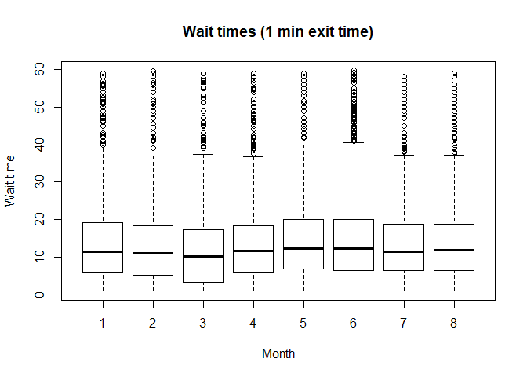
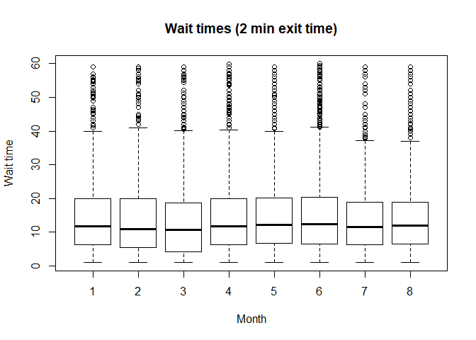

Highlights
================
Clare Clingain

# Overview

The 1 train has a reputation for being named after the number of minutes
by which you miss the Staten Island ferry. This project set out to
understand that myth using MTA Historical Real Time data and Staten
Island Ferry departure data. Specficially, this project attempted to
answer three questions.

1)  What does the distribution of wait times look like for connections
    between the 1 train and the Staten Island Ferry?

2)  How does this distribution vary across time (e.g., rush hour vs
    tourist peak)?

3)  How does this distribution vary for people who can run versus people
    who can’t run from the 1 train to the ferry?

To answer the third question, I added either 1, 2, or 3 minutes to the
arrival time at South Ferry as a buffer for time to exit the train and
enter Whitehall terminal. With the addition of the exit time, I then
found the closest ferry to each train arrival and derived the wait time
until the next ferry.

Perhaps by accident, but mostly by design, the results for question 3
are intertwined with the first two questions.

# Q1: Wait Time Distributions

Below are the wait time distributions for the three exit times. The
distributions look quite similar. I used a two-sample Kolmogorov-Smirnov
test to determine whether each distribution was different from the other
two. After adjusting the p-values via Benjamini-Hochberg, I found all
three distributions to be significantly different from one another.
However, I am cautious to interpret the results of the KS test given
that the independence assumption of my data is conditional on train
spacing. A train arrival in January is independent from a train arrival
in May, but any two consecutive trains are probably not
independent.

<!-- -->

# Q2: Marginal Wait Time Distributions

After getting the overall distributions, I decided to examine the
marginal distributions as functions of time of day. This section will
move from the moew granular to the more general.

## Rush hour vs Non-rush hour

The hours of the day were split into the following three categories
based on the ferry schedule:

  - Morning rush: 7 am to 9 am, inclusive
  - Evening rush: 4pm to 7pm, inclusive
  - Non rush: 8pm to 6 am, inclusive

Across all three exit times, morning rush hour and evening rush hour
look similar. Both appear to have a similar quantity of nightmare waits
(30+ minutes). The noticeable difference is between the rush hour times
and the non-rush hour time. The median wait time during non-rush hour is
much higher, and the distribution has a greater
variance.

<!-- --><!-- --><!-- -->

## Hours of the day

The morning rush, evening rush, and non-rush hour comparison aggregated
time blocks, but are there hour-by-hour differences in wait times? Based
on the median plot below, wait time does appear to vary as a function of
hour of the day. As soon as the morning rush hour is over, the median
wait times jump from less than 10 minutes to 15 to 18 minutes. This jump
is consistent for all three exit times. As the evening rush approaches,
wait times decrease, but steadily climb throughout the midnight hours.

<!-- -->

## Day of the week

Given the differences across hours, I checked for differences across
days of the week. There seems to be a strange pattern where Tuesday and
Thursday have slightly higher medians than Monday, Wednesday, and
Friday, which resemble each other. This could be an artifact of the
data. The good news is that Monday doesn’t have the highest
median.

<!-- --><!-- --><!-- -->

## Month

Finally, given that the data spans from January to August, I checked to
see if the distributions vary across the months. Based on the
side-by-side boxplots, it’s difficult to distinguish minute differences.
However, May easily sticks out as the month with the highest median and
the most
variance.

<!-- --><!-- --><!-- -->

# Q3: Differences by exit time?

Based on the results above, it seems that the differences between the
wait times are largely conditional on the time of day. During rush hour,
it doesn’t seem to make a difference if you can run or not, on average.
