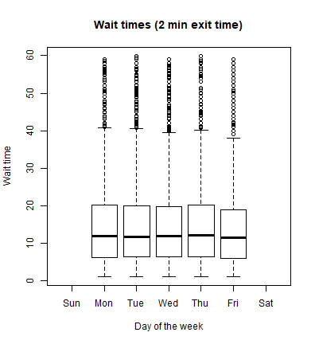
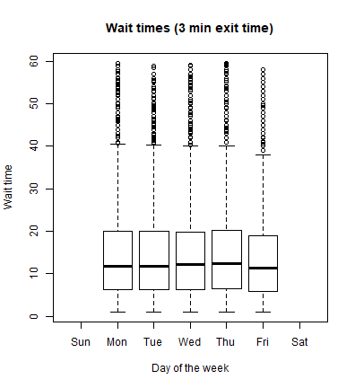
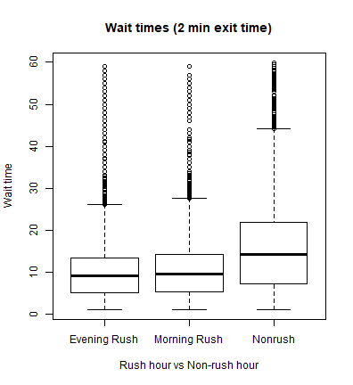
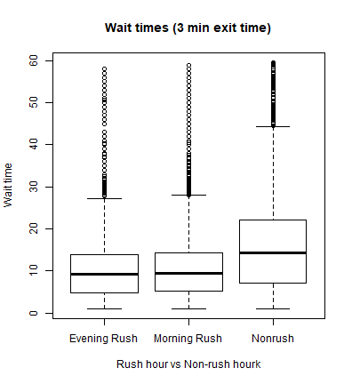

Final Presentation
========================================================
author: Clare Clingain
autosize: true
font-family: 'Helvetica'
css: CSS/final_project.css

Overview
========================================================

- An urban myth exists among Staten Islanders: the 1 train is named after exactly how many minutes you'll miss the ferry by.
-  Considering that the 1 train's final destination is South Ferry -- the station that connects to the Staten Island Ferry -- this is concerning.
- Staten Islanders have some of the longest commutes in the country, and the Staten Island ferry is also a major tourist attraction.

Research Questions
========================================================

1) What does the distribution of lateness look like for connections between the 1 train and the Staten Island Ferry?

2) How does this distribution vary across time (e.g., rush hour vs tourist peak)?

3) How does this distribution vary for people who can run versus people who can't run from the 1 train to the ferry?

Data
========================================================

<b>Time:</b> January 2018 - August 2018

<b>MTA Historical Real-Time Data:</b> 5-minute intervals

<b>Staten Island Ferry Historical Data:</b> All departures from Whitehall terminal

Data Process
========================================================
Massive amounts of data cleaning...

</img>

Issues and Evolution
========================================================

- Further cleaning needed
- Ferry data in odd format
- Reframing research questions given data

RQ 1: The wait time distribution(s)
========================================================

RQ 2: Morning Rush vs Evening Rush vs Nonrush  
========================================================

RQ 2: Rush hour vs Non-rush hour
========================================================

RQ 3: Median wait times by hour... who waits longer and when?
========================================================

Final Steps
========================================================
For each wait time, what's the probability of...
- waiting longer than 30 minutes
- having a wait time between 27-29 minutes (the myth)
- having a wait time less that 5 minutes
