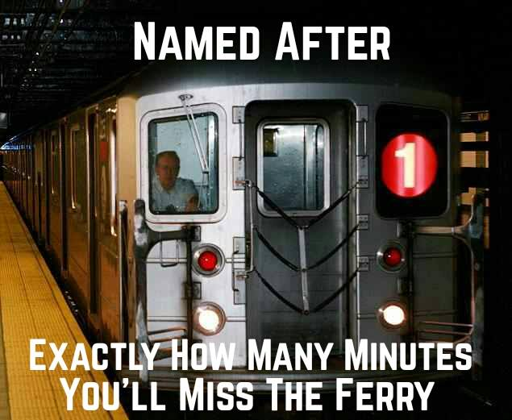
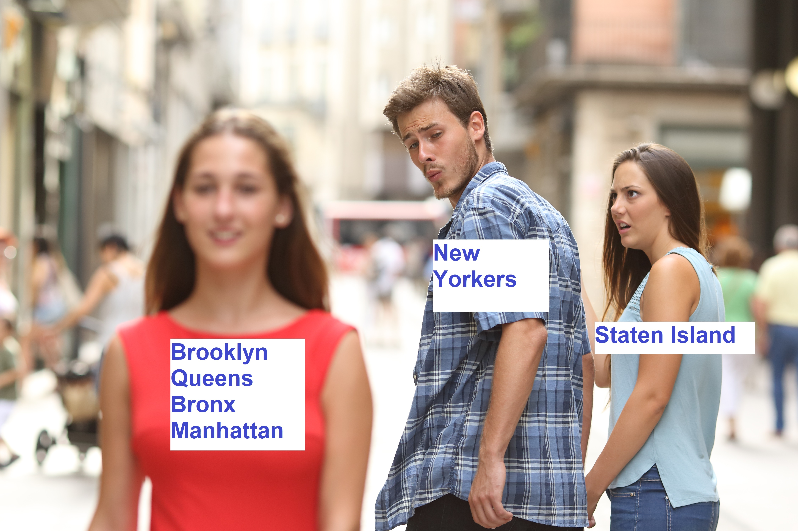

# Making Connections: Transfers between the 1 train and the Staten Island Ferry

## What's the problem?

Poor subway service is affecting millions of New Yorkers, but some of us have another nightmare: making connections from the subway to the Staten Island Ferry. Nobody wants to wait 30 minutes for the next ferry all because the 1 train took its sweet time pulling into South Ferry station. 

The poor service on the 1 train has become so bad that Staten Islanders have christened it with a grammatically incorrect meme: the 1 train is named after how many minutes you’ll miss ferry. 

Any Staten Islander will tell you this is true and go on an angry rant about the 1 train and the ferry. Out of my own frustrations, I created the second meme: everyone ignores Staten Island!

## Well, how bad is it?

Let’s get a little serious – Staten Islanders have some of the worst commutes in the country, with an average commute of 69 minutes each way. Compare this to the average of about 40 minutes for other New Yorkers. Yet research has shown that long commutes can detract from people’s quality of life and is associated with lower life satisfaction. The public transportation issue for Staten Islanders isn’t only related to their quality of life, but their love lives as well! Surveys of single New Yorkers found that only 8 percent of Manhattan, Brooklyn, and Queens residents said they would be willing to regularly date someone who lives on the Island, with most single New Yorkers citing public transportation as the biggest issue with dating someone from Staten Island! Those of us lucky enough to date among that 8 percent never hear the end of how long it took to get the Island from our significant others.

## What can we do?

If we can improve the connection between the 1 train and the Staten Island ferry, that could shave off up to 30 minute wait times for commuters. We turn to data to get answers to two questions. 

1. How often is the 1 train late to making the connection to the Staten Island Ferry? 

2. What schedule changes can be implemented so that the connection is made more often?

Answering these questions is tricky. How do we quantify "lateness"? What sort of margin should be given to account for passengers exiting the subway station and entering the ferry terminal?

## Data Sources

1. [MTA Real Time Subway data](http://datamine.mta.info/) is accessible with an API
2. [Staten Island Ferry Departure data](https://data.cityofnewyork.us/Transportation/Test-Staten-Island-Ferry-Daily-Performance-data/7gic-pibm)

Yes, the MTA data is just as messy as the subways, buses, trains, and ferries. 

## Plans + Goals

I’m not sure what approach I will use as I’ve not yet seen the data, but after accessing and cleaning the data, I will start with some exploratory analysis. The goal of this project is to have the MTA implement actual schedule changes, but as my grandma aptly told me, “Why would they do that?”
